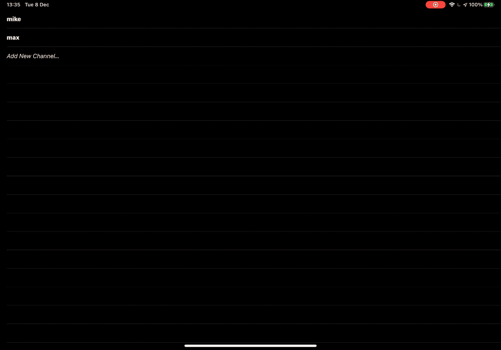

# Agora RTM iOS Example

With this example project, create an RTM system where people can join group video chats with friends or strangers.

# Requirements

- An Agora developer account (see [How To Get Started with Agora](https://www.agora.io/en/blog/how-to-get-started-with-agora?utm_source=medium&utm_source=medium&utm_medium=github&utm_campaign=agora-rtm-ios))
- Xcode 11.0 or later
- An iOS device running on iOS 12.0 or later.
- A basic understanding of iOS development
- Cocoapods

# Setup

Run `pod install --repo-update` and open up the .xcworkspace file.

Add your Agora App ID and Token into the placeholders, then build + run.